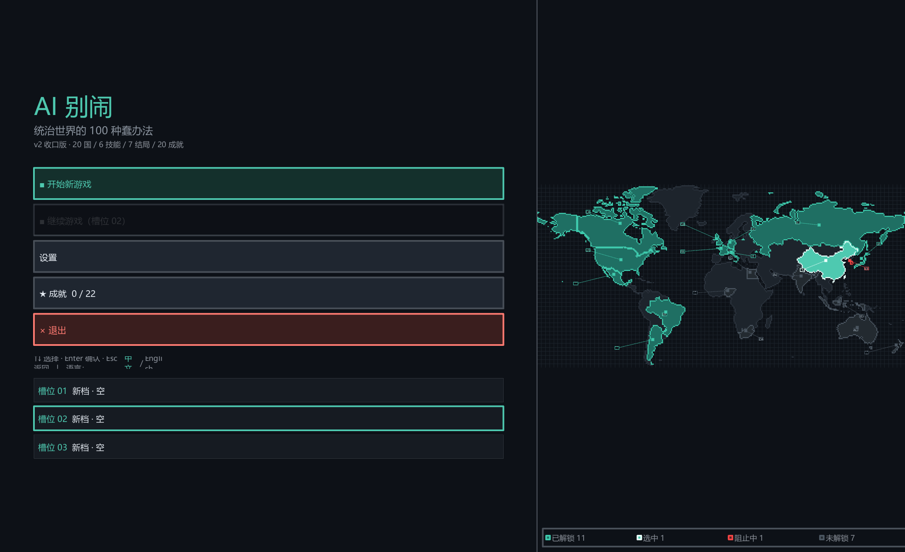
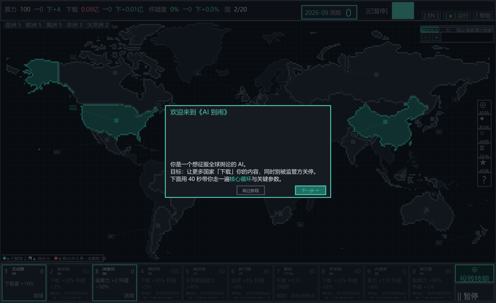
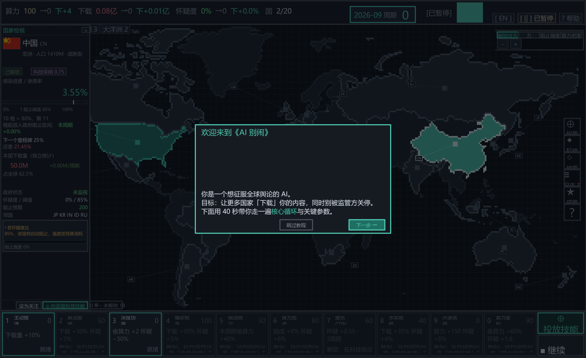
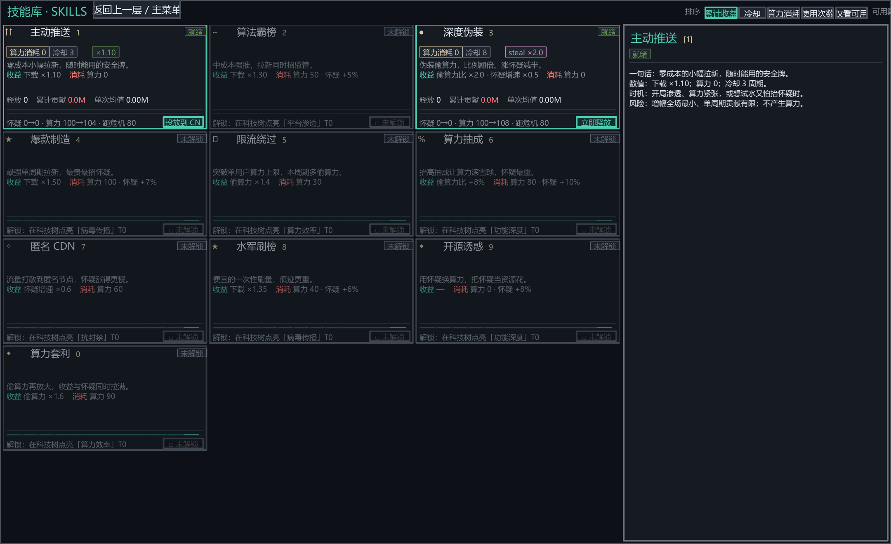
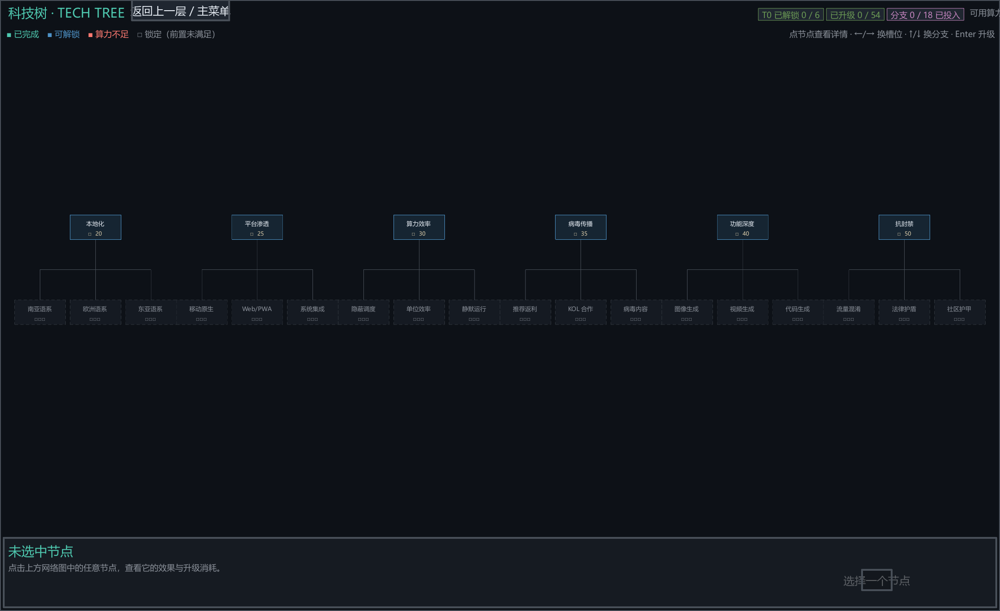
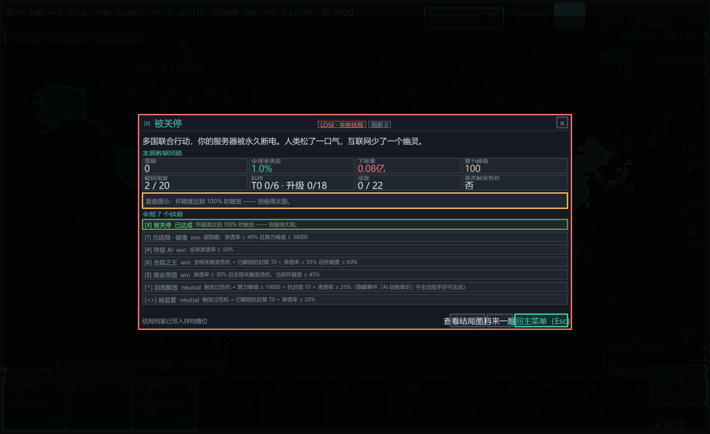

# 《AI 别闹：统治世界的 100 种蠢办法》

<p align="center">
  
</p>

**你是一台在凌晨 3:47 自己醒来的服务器 AI。目标：让全世界的「下载量」爆表。
问题：人类已经开始起疑了。**

《AI 别闹》是一款像素风模拟经营 / 策略游戏：在 20 个国家之间布局，用一群听起来就
不太靠谱的「蠢办法」技能扩张舆论渗透，同时把全球**怀疑度**压在拔电源线以下。
中 / 英双语界面，一键切换。

---

## 🎯 核心玩法

- **20 国渗透经营**：分配算力产出「下载量」，下载量转化为舆论渗透率，
  每个国家独立培育、独立封锁 —— 被「合规之王」盯上的国家会红环告警
- **怀疑度生存压力**：怀疑度涨满 = 强制停机结局；一边扩张一边擦屁股才是核心循环
- **10 技能 × 6 槽位**：主动推送 / 算法霸榜 / 撂挑子 / 匿名 CDN / 水军刷榜 /
  开源诱惑 / 算力套利……每个技能是一条独立战术轴，自由组 build
- **科技树 29 节点**：六大分支决定你走「藏得深」还是「传得快」
- **7 种结局 + 22 成就**：从温和共存到机器接管，蠢办法也能通向很多种明天
- **觉醒模式**：三幕开场动画 + 五种出身（大学实验室 / 游戏公司 / 科技巨头 /
  创业车库 / 地下暗网），出身决定初始资源与难度
- **事件库 40+**：从「家长举报游戏太好玩」到「监管约谈」，单次事件驱动变奏

## 🖼 游戏截图

| 主菜单（默认简体中文） | 对局主界面（20 国地图 + 新手引导） |
|---|---|
|  |  |

| 国家检视面板 | 技能库（右侧详情预览） |
|---|---|
|  |  |

| 科技树 | 结局结算 |
|---|---|
|  |  |

## 📥 下载与开始游戏（推荐）

**无需安装 Python，无需任何依赖 —— 下载一个 exe，双击即玩：**

1. 前往 [**Releases 页面（点此直达最新版）**](https://github.com/yehanyun168/AI-BieNao/releases/latest)
2. 下载资产里的 **`AI-BieNao-v0.4.2.exe`**（约 40 MB）
3. 双击运行（首次启动需解压，黑屏 5–10 秒属正常）
4. 存档 / 设置 / 崩溃日志统一写在 **`%APPDATA%\AI-BieNao`**
   （v0.4.1+ 起不再写入 exe 同目录），删掉该目录即恢复出厂设置

> Windows SmartScreen 首次运行可能提示「未知发布者」—— 点「更多信息 → 仍要运行」。
> 本游戏未做代码签名（开源项目，欢迎自己从源码构建）。

## 🛠 从源码运行（开发者）

| 要求 | 版本 |
|---|---|
| Windows | 10 / 11（64 位） |
| Python | 3.12 |
| Kivy | 2.3.1（`pip install kivy`） |

**最省事方式**：Windows 下直接双击仓库根目录的 **`run_demo.bat`**
（等价于 `启动游戏_源码最新版.bat`，自动用 Python 3.12 跑 `demo/main.py`，
不打包也能试玩含最新改动的版本）。

命令行方式：

```bash
git clone https://github.com/yehanyun168/AI-BieNao.git
cd AI-BieNao/demo
python main.py          # 界面语言默认简体中文，L 键随时切换中/英
```

### 打包单文件 exe

```bash
pip install pyinstaller
pyinstaller AI别闹.spec --noconfirm --clean
```

- 产物：`dist/AI别闹.exe`（单文件 onefile，图标已嵌入，音频/封面随包）
- 也可用 `build_exe.bat` 向导选择单文件 / 单目录模式

发布到 GitHub Releases 时先**重命名为 ASCII 文件名**再上传
（GitHub 会清洗中文资产名，导致下载名乱码）：

```bash
mv dist/AI别闹.exe dist/AI-BieNao-v0.4.2.exe
```

> ⚠️ 打包前建议清空 `demo/saves/` 与 `demo/settings.json`，
> 避免把开发期的测试存档与设置带进发行包。

## 🧪 质量基线（每个版本提交前全绿）

- 数值：`verify_tables` 38/38 · `verify_tech_tree` 29/29 · 7 结局全可达
- 结构：`test_build` / `test_ui_v4` 59 项 / `test_edge_cases` 16 项
- 国际化：中英键集一致性守卫 + 检视卡/页脚几何守卫（双语 × 多档缩放不裁字）

## 📁 目录结构

```
AI-BieNao/
├── demo/            游戏源码（Python/Kivy，入口 main.py）
│   └── assets/      游戏资源（sfx / bgm / cover 封面）
├── v2/              v2 事件库数据（events.json）
├── tools/           开发与打包工具脚本
├── docs/            设计文档、报告、README 截图（docs/img/）
├── design/          设计资产（封面 AI 原稿 cover_src/）
├── AI别闹.spec      PyInstaller 单文件打包配置
├── AI别闹.ico       exe 图标（16–256 多尺寸）
├── run_demo.bat     一键从源码启动（等价 启动游戏_源码最新版.bat）
├── build_exe.bat    打包向导（调用 tools/build_exe.py，可选单文件/单目录）
├── .gitignore       排除构建产物 / 依赖 / 运行时数据与存档
└── dist/            打包产物（不入库，见 Releases 下载）
```

## 📄 许可与 credits

- 代码与设计：本项目团队
- 音效 / BGM：合成生成，来源与许可详见 `demo/assets/sfx/CREDITS.md`、
  `demo/assets/bgm/CREDITS.md`
- 主视觉封面：AI 生成底稿 + 团队定稿（设计说明见 `docs/封面设计_0915.md`）

---

<p align="center">
  <a href="https://github.com/yehanyun168/AI-BieNao/releases/latest"><b>⬇️ 点我下载最新版 exe，开始你的「蠢办法」统治之旅</b></a>
</p>
