# 《AI 别闹》模块依赖架构审查

> 扫描范围：`demo/` 下 **53 个非测试运行时模块**（已排除 `test_*`、`verify_*`、`make_screenshots*`、`balance_sim`、`perf*` 等开发/QA 脚本，它们不属于运行时架构边界）。
> 方法：用 AST 提取 `import`/`from ... import` 边，构建有向依赖图 → DFS 环检测 → 计算 fan-in（被依赖数，衡量核心度）。
> 说明：本图是**静态编译期依赖**。运行时通过回调函数、Kivy 事件、`app` 句柄的鸭子类型耦合（弱依赖）无法从 import 体现，文中单独标注。

---

## 1. 总体分层（依赖方向自上而下）

```
A 入口与编排   main, tutorial
B 过场动画     intro, intro_common, intro_shots
C 界面屏幕层   ui_v4_screens(聚合), ui_hud, ui_pages, ui_popups, ui_session, ui_preferences, ui_commissions, ui_drop, ui_input
D UI 设计系统  ui_v4(基), ui_v4_common, ui_v4_canvas, ui_v4_cards, ui_v4_panels, ui_v4_syspages, ui_shared, ui_modal, ui_fx
E 引擎与持久化 engine, save_manager, preferences, paths
F 内容与规则   balance, data, tech_tree, achievements, commissions, endings, v2_events, country_events, origins, conditions, world_map, flag_draw, challenge, thresholds, onboarding
G 基础原语与音频 i18n, pixel_ui, pixel_assets, sfx, bgm, cursor_fx
```

依赖流向：**上层依赖下层**（A→B→C→D→E→F→G），`engine` 不 reverse-import UI，符合「引擎不依赖 UI」铁律。

---

## 2. 各层职责与边界

| 层 | 模块 | 职责 | 边界（不应越界做的事） |
|----|------|------|------------------------|
| A 入口 | `main` | App 入口、总装、驱动 tick、装配所有 Mixin 成 `GameUI` | 不应包含游戏规则数值（放 `balance`） |
| A 入口 | `tutorial` | 新手引导步骤机，叠遮罩/高亮/气泡 | ⚠ 当前违规：反向 import `main.GameUI`（见 §4） |
| B 过场 | `intro`/`intro_common`/`intro_shots` | 开场 10 镜播放、派生色、缓动 | 只依赖 `ui_v4`/`pixel_ui`/`sfx`/`bgm`/`i18n`，不碰引擎 |
| C 屏幕 | 9 个 `ui_*` 功能屏 | 各玩法界面（HUD/弹窗/委托/投放/输入…） | 只消费 `engine`/`data` 的状态与常量，不改写模拟 |
| D 设计系统 | `ui_v4` 家族 | 像素设计令牌、卡片/面板/画布/页签组件 | 纯展示，不持有游戏状态 |
| E 引擎 | `engine` | 模拟核心：tick、胜负、事件派发 | **不 import 任何 UI**（已验证 ✅） |
| E 持久化 | `save_manager`/`preferences`/`paths` | 存档/设置/数据目录（%APPDATA%/AI-BieNao） | 不依赖 UI |
| F 内容 | `balance`(TUNE 唯一数值源)/`data`/`tech_tree`/`achievements`/`commissions`/`endings`/`v2_events`/`country_events`/`origins`/`conditions`/`world_map`/`flag_draw` 等 | 规则、数值表、旗绘制、挑战、阈值 | 声明式条件，不依赖 UI |
| G 基础 | `i18n`/`pixel_ui`/`pixel_assets`/`sfx`/`bgm`/`cursor_fx` | 本地化、像素组件、精灵图、音效、配乐、光标特效 | **全部为叶子（无内部依赖）**，是全局服务 |

---

## 3. 模块依赖架构图（Mermaid，可渲染）

```mermaid
flowchart TD
    subgraph A["A · 入口与编排"]
        main["main (App 入口·总装)"]
        tutorial["tutorial (新手引导)"]
    end
    subgraph B["B · 过场动画"]
        intro["intro"]; intro_common["intro_common"]; intro_shots["intro_shots"]
    end
    subgraph C["C · 界面屏幕层"]
        uiscreens["ui_v4_screens(聚合)"]; uihud["ui_hud"]; uipages["ui_pages"]
        uipopups["ui_popups"]; uisession["ui_session"]; uipref["ui_preferences"]
        uicomm["ui_commissions"]; uidrop["ui_drop"]; uiinput["ui_input"]
    end
    subgraph D["D · UI 设计系统"]
        uiv4["ui_v4(基)"]; uiv4c["ui_v4_common"]; uiv4cv["ui_v4_canvas"]
        uiv4cd["ui_v4_cards"]; uiv4p["ui_v4_panels"]; uiv4s["ui_v4_syspages"]
        uishared["ui_shared"]; uimodal["ui_modal"]; uifx["ui_fx"]
    end
    subgraph E["E · 引擎与持久化"]
        engine["engine(模拟核心)"]; savemgr["save_manager"]; prefs["preferences"]; paths["paths"]
    end
    subgraph F["F · 内容与规则"]
        balance["balance(TUNE)"]; data["data"]; techtree["tech_tree"]; ach["achievements"]
        comm["commissions"]; endings["endings"]; v2e["v2_events"]; ce["country_events"]
        origins["origins"]; cond["conditions"]; wm["world_map"]; fd["flag_draw"]
        ch["challenge"]; th["thresholds"]; ob["onboarding"]
    end
    subgraph G["G · 基础原语与音频"]
        i18n["i18n"]; pui["pixel_ui"]; passets["pixel_assets"]; sfx["sfx"]; bgm["bgm"]; cfx["cursor_fx"]
    end

    main -->|驱动 tick/读状态| engine
    main --> uiscreens
    main -->|播放开场| intro
    main -. "⚠ 循环" .-> tutorial
    tutorial -. "⚠ 循环" .-> main
    tutorial --> engine
    tutorial --> uimodal
    tutorial --> uiv4
    intro --> uiv4
    intro --> sfx
    intro --> bgm
    uiscreens --> uiv4
    uiscreens --> uiv4cv
    uiscreens --> uiv4cd
    uiscreens --> uiv4p
    uiscreens --> uiv4s
    uihud --> uiv4
    uipages -->|玩家操作→指令| engine
    uiinput --> engine
    uicomm --> engine
    uiv4 -->|复用像素组件| pui
    uiv4 --> sfx
    uiv4 --> i18n
    uiv4c --> fd
    uiv4c --> passets
    engine -->|读数值| balance
    engine -->|读国家表| data
    engine --> techtree
    engine --> ach
    engine --> comm
    engine --> endings
    engine --> v2e
    savemgr --> engine
    savemgr --> paths
    prefs --> paths
    data --> wm
    wm --> passets
    fd --> passets
    uishared --> pui
```



---

## 4. 依赖关系分类

### 4.1 强依赖（编译期硬 import）
图中全部有向边均为强依赖——Python 无接口边界，import 即耦合。其中**单向、方向正确**的是健康部分；唯一异常是循环（见下）。

### 4.2 弱依赖（运行时/事件/鸭子类型，静态图不可见）
- 多个 UI 屏（`ui_hud`/`ui_pages`/`ui_input`/`ui_commissions`）持有 `app` 句柄，运行时读取 `engine` 状态与 `data` 表，但导入层只取常量/类型 → 属「弱语义耦合」。
- `ui_shared` 是跨屏共享 Mixin，通过继承被各屏复用，属「弱组合」。
- Kivy 事件（`on_enter`/`on_leave`/`Clock` 触发）驱动屏间流转，属事件弱依赖。

### 4.3 循环依赖（唯一，⚠ 风险项）
**`main ↔ tutorial`**
- `main.py:426` `from tutorial import TutorialController`
- `tutorial.py:35` `from main import GameUI`

**已核实事实**：`tutorial` 对 `GameUI` 的使用**仅**为惰性字符串注解（`def __init__(self, game: 'GameUI')`，line 199），无任何 `isinstance` 或运行时类引用；其文档注释（line 9）甚至声明「避免反向 import main」——属注释漂移 + 真实环。

**修复方案（已验证可行）**：
1. 删除 `tutorial.py:35` 的 `from main import GameUI`；
2. 在 `tutorial.py` 顶部加 `from __future__ import annotations`（注解延迟求值，无需运行期导入）。
→ 环即断开：`tutorial` 不再 import `main`，仅保留 `main → tutorial` 单向（编排者依赖控制器，正确方向）。低风险、零功能改动。建议作为 P1 清理项并入下一提交。

---

## 5. 核心度（fan-in）排名与含义

| 模块 | fan-in | 含义 |
|------|-------:|------|
| i18n | 22 | 全局本地化服务，最高核心度；**API 须严格稳定** |
| ui_v4 | 19 | UI 设计系统基座，所有屏/组件依赖 |
| pixel_ui | 18 | 像素组件原语，渲染层地基 |
| sfx | 18 | 音效服务，全局 |
| engine | 12 | 模拟核心（注意：不依赖 UI，方向健康） |
| balance / data / origins / pixel_assets | 10 | 数值源 / 数据表 / 起源 / 精灵图 |
| ui_shared | 9 | 跨屏共享 Mixin |
| tech_tree / ui_v4_screens | 7 | 科技树 / 屏幕聚合器 |
| achievements / flag_draw / save_manager / commissions / bgm / ui_modal / ui_v4_common | 4–6 | 内容/组件中层 |

**结论**：前 4 名（`i18n`/`ui_v4`/`pixel_ui`/`sfx`）是「牵一发而动全身」的基础设施，任何改动必须配回归测试（项目已有 `verify_*` 守卫覆盖大部分）。

---

## 6. 缺失子系统（诚实告知，非缺陷）

- **物理（Physics）**：无。本作为回合/tick 制的地缘 AI 模拟游戏，不需要刚体/碰撞物理引擎——属设计使然。
- **网络（Network）**：无运行时网络模块。游戏为单机本地运行；GitHub 仅用于分发，不参与运行时。
- **资源管理（Resource Manager）**：无独立资源管理器。像素资源在 import 期由 `pixel_assets`/`pixel_ui` 直接加载，无运行时热加载/释放调度（当前资产规模下足够）。

这三点**不是架构漏洞**，审查时无需「补齐」。

---

## 7. 架构健康度结论与建议

✅ **整体良好**：分层清晰，依赖方向自上而下（UI→引擎→基础），`engine` 不反向依赖 UI（与项目「引擎不依赖 UI」铁律一致）。`ui_v4_*` 家族已按职责拆分（common/canvas/cards/panels/syspages），聚合层 `ui_v4_screens` 单一出口，外部统一 `import ui_v4_screens as S`。

⚠️ **唯一结构风险**：`main ↔ tutorial` 循环依赖，按 §4.3 方案可一键破环，建议下周迭代清理。

🛡️ **稳定性重点**：`i18n`/`ui_v4`/`pixel_ui`/`sfx` 高 fan-in，改前先跑 `verify_tables`/`verify_tech_tree`/`test_build` 等守卫。

📌 **边界提醒**：`verify_*` 文件是开发期 QA 脚本，不计入运行时架构；它们 import `main`/`engine` 是为离线校验，不影响发布包。

---
*生成方式：AST 静态扫描 + DFS 环检测 + fan-in 统计；数据基于 `demo/` 当前 53 个运行时模块。*
